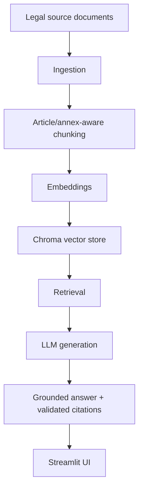
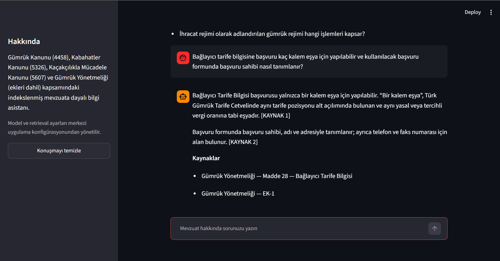
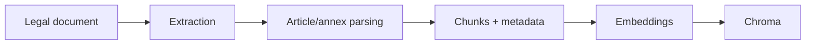
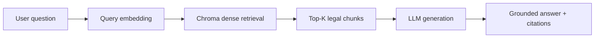

# Gümrük Mevzuatı Chatbot

A citation-integrity-checked Retrieval-Augmented Generation (RAG) assistant
over Turkish customs legislation. It is designed and instructed to answer
questions using only text retrieved from an indexed corpus of four legal
sources — an evidence-constrained behavior enforced by prompting and by the
citation check below, not a mechanical guarantee that the model's prose
never draws on anything else. Every `[KAYNAK N]`
(SOURCE N) label the model uses in an answer is mechanically checked against
the chunks actually retrieved before that answer is ever returned to a user —
this proves the citation *integrity* of what is shown (a cited source really
was retrieved for this question), not that every claim near it is a correct
reading of that source's text. See
[Source and citation model](#source-and-citation-model) for the exact
guarantee and its limits.

> **Not legal advice.** This project is an information assistant, not a legal
> opinion or a binding customs decision. See [Limitations](#limitations).

## Table of contents

- [Purpose](#purpose)
- [Engineering approach](#engineering-approach)
- [Architecture](#architecture)
- [Supported sources](#supported-sources)
- [Demo](#demo)
- [RAG flow](#rag-flow)
- [Source and citation model](#source-and-citation-model)
- [Setup and run](#setup-and-run)
- [Evaluation summary](#evaluation-summary)
- [Limitations](#limitations)
- [Future work](#future-work)

## Purpose

Turkish customs practice spans several separate laws and one large
implementing regulation, and answers frequently depend on cross-references
between them (e.g. a regulation article and the annex form it points to).
This project builds a small, auditable RAG pipeline that:

- indexes those sources as legally-structured chunks — split first by
  article/annex boundary, then further split only if a single article/annex
  still exceeds a soft character-size bound (`MAX_CHUNK_CHARS`, default
  4000) — never as arbitrary fixed-size windows regardless of legal
  structure,
- retrieves the most relevant chunks for a question via dense vector search,
  and
- generates a grounded Turkish answer whose `[KAYNAK N]` citations are
  checked mechanically against what was actually retrieved, so a citation to
  a chunk that was never retrieved can never silently reach a user.

No agent framework or external orchestration framework is added by this
project. Chroma's local `PersistentClient` uses SQLite internally for its
own storage (`chroma.sqlite3`) — this codebase does not design, own, or
query a SQL schema of its own on top of that. See `AGENTS.md`.

## Engineering approach

This project was developed as a measured retrieval system rather than a
prompt-and-demo prototype.

- **Measured retrieval, not subjective inspection.** Retrieval quality is
  evaluated with frozen question sets and metrics such as Hit@K, Recall@K,
  MRR and multi-source coverage — see [Evaluation summary](#evaluation-summary)
  and `docs/evaluation.md`.
- **Failed experiments are preserved, not discarded.** A dense+BM25 hybrid
  retrieval candidate (`docs/m10e-experiment-protocol.md`) looked promising
  on its development benchmark, but was rejected after failing one of its
  own predeclared gates on a separate blind holdout it had not been tuned
  against; production retrieval was left unchanged
  (`reports/evaluation/m10e-holdout-b0-vs-b2.md`). A later milestone
  evaluated five further retrieval-optimization candidates (explicit-law
  routing, larger candidate pools, oracle document filtering, a centroid
  router, an LLM router) and adopted none of them, for reasons specific to
  each — see `docs/m12f-retrieval-optimization-closure.md`.
- **Single-variable controlled experiments.** `scripts/compare_distance_metrics.py`
  is a one-off diagnostic that holds every variable fixed except the Chroma
  distance metric (L2 vs. cosine) to isolate its effect alone, rather than
  changing several variables at once. That specific script's own output is
  not itself committed as a report; the general practice of recording a
  conclusion even when no improvement is found or no candidate is adopted is
  demonstrated by the M12F and M10E closures linked above.
- **Additive indexing with regression protection.** Adding a new source
  (most recently the Gümrük Yönetmeliği, M13) uses deterministic chunk/annex
  identities, collision and corpus-count checks, explicit idempotence gates,
  and preservation snapshots/fingerprints taken before and after each
  indexing run, so that previously indexed records can be checked for being
  unchanged rather than assumed to be — see
  `reports/evaluation/m13db-preflight.json` for an example of the
  fingerprints actually recorded.
- **Fail-closed grounding.** Generation is instructed to answer only from
  retrieved evidence and to report insufficient evidence when necessary.
  `[KAYNAK N]` citation references are mechanically validated against the
  chunks actually retrieved — see
  [Source and citation model](#source-and-citation-model) for exactly what
  that validation does and does not prove.
- **Reproducibility.** Frozen evaluation datasets (with recorded hashes),
  experiment reports, preflight gates, and the record of rejected candidates
  all remain versioned in this repository under `evaluation/`, `reports/`,
  and `docs/`, rather than living only in chat history or a developer's
  local notes.

## Architecture



| Layer | Module | Responsibility |
| --- | --- | --- |
| Extraction | `src/ingest.py` (main-body `.docx`), `src/annex_ingest.py` (annex ZIP, heterogeneous member formats) | Reads raw sources into ordered paragraphs/annex units. |
| Chunking | `src/chunk.py`, `src/annex_chunk.py` | Legal-structure-aware chunking (article/annex boundary first, soft size bound second), attaches source metadata. |
| Embedding | `src/embed.py` | Builds embedding text and calls the OpenAI embedding model. |
| Indexing | `src/index.py` | Upserts chunks + precomputed vectors into a local Chroma collection. |
| Identity | `src/source_identity.py`, `src/source_registry.py` | Canonical per-provision/per-annex keys; explicit document manifest admission. |
| Retrieval | `src/retrieve.py` | Query embedding + dense top-`TOP_K` lookup against the Chroma collection. |
| Generation | `src/generate.py` | Grounded answer generation with citation-integrity validation. |
| Orchestration | `src/rag.py` | One retrieval + one generation call, with cross-layer consistency checks. |
| UI | `app.py`, `src/ui.py` | Streamlit chat interface. |

## Supported sources

The production Chroma collection (`gumruk_mevzuati`) currently holds
**1,266 vectors across 4 sources**:

| Document ID | Title | Type | Chunks indexed |
| --- | --- | --- | --- |
| `5326_kabahatler_kanunu` | Kabahatler Kanunu (Law No. 5326) | Kanun | 53 |
| `4458_gumruk_kanunu` | Gümrük Kanunu (Law No. 4458) | Kanun | 276 |
| `5607_kacakcilikla_mucadele_kanunu` | Kaçakçılıkla Mücadele Kanunu (Law No. 5607) | Kanun | 46 |
| `gumruk_yonetmeligi` | Gümrük Yönetmeliği + annexes (EK-1 … EK-83, plus sub-annexes) | Yönetmelik | 891 |

The Gümrük Yönetmeliği (customs implementing regulation) is indexed both as
articles (`normal`/`gecici` provisions) and as its annexes: 83 base annexes
(`EK-1` … `EK-83`) plus 15 lettered sub-annexes (e.g. `EK-77/A`), for **98
logical annex units** in total, using a dedicated `AnnexSourceKey` identity
distinct from article identity. It is based on Law No. 4458 but is
registered under its own `document_id`; 4458 is never used as a fallback
identity for it.

Source provenance (official URL, retrieval date, and legislation number
where applicable) for all four documents is recorded in
`data/source_manifest.json`. The Gümrük Yönetmeliği is a regulation, not a
numbered law, and its manifest record carries no `legislation_number` — it
must not be assumed to have one.

## Demo

A live run of this mixed article + annex query:

> Bağlayıcı tarife bilgisine başvuru kaç kalem eşya için yapılabilir ve
> kullanılacak başvuru formunda başvuru sahibi nasıl tanımlanır?

retrieved both **Gümrük Yönetmeliği — Madde 28** and **Gümrük Yönetmeliği —
EK-1**. Both citation references were validated against the retrieved chunks
before the answer was returned.



See `docs/demo-guide.md` for four more example queries.

## RAG flow

**Offline indexing** (run once per source, whenever a source is added or
re-indexed):



**Online query** (run per user question):



`src/rag.py` composes exactly one retrieval call and one generation call, in
that order, and re-validates that the generation layer's context matches the
retrieval layer's results exactly (same chunk IDs, same order) before
returning a combined `RAGResult`.

## Source and citation model

- Retrieved chunks are numbered `[KAYNAK 1]` … `[KAYNAK N]` in retrieval
  order and passed to the model as an explicitly labeled evidence block —
  never merged with the instructions, and the model is told to treat any
  instruction-like text inside that block as data, not a command.
- The model must answer in a fixed envelope:
  ```
  DURUM: YETERLI | YETERSIZ
  CEVAP:
  <answer text, with inline [KAYNAK N] citations>
  ```
  `YETERSIZ` ("insufficient") means the retrieved sources do not fully
  support an answer; the assistant is instructed to say so explicitly rather
  than fill the gap from the model's own knowledge.
- Every `[KAYNAK N]` in the answer is checked against the chunks that were
  actually supplied. A citation to a chunk number that was never retrieved
  raises `CitationValidationError` and the result is never returned to the
  user — a hallucinated citation fails closed, it is never silently dropped.
  A `YETERLI` answer with zero valid citations is rejected the same way.
- Each validated citation's document/article/annex fields are copied
  verbatim from the retrieved chunk's own metadata and the source manifest —
  never parsed from the model's prose.
- **What this proves, and what it doesn't:** citation validation proves
  citation *integrity* — "`[KAYNAK N]` really does point at a chunk that was
  retrieved for this question." It does **not** prove citation
  *correctness* — that every claim near that marker is semantically
  entailed by that chunk's text. That is a materially harder problem and is
  explicitly out of scope (see [Limitations](#limitations)).
- If retrieval returns zero chunks, the assistant returns a fixed
  insufficient-context message without calling the LLM at all.

## Setup and run

### Requirements

```powershell
python -m venv .venv
.\.venv\Scripts\Activate.ps1
pip install -r requirements.txt
```

Python 3.10+ is required.

### Environment variables

Copy `.env.example` to `.env` and set `OPENAI_API_KEY`. Never commit a real
key. Other settings (`LLM_MODEL`, `EMBEDDING_MODEL`, `TOP_K`, `TEMPERATURE`,
`COLLECTION_NAME`, `CHROMA_PATH`, ...) are all read centrally from
`src/config.py`; see that file and `.env.example` for defaults.

### Data preparation (ingest → chunk → index)

Raw legal source files (`data/raw/`) and the built Chroma index (`chroma/`)
are intentionally **not** committed to this repository (see `.gitignore` and
`AGENTS.md`). Not all raw sources are the same file type: the manifest at
`data/source_manifest.json` lists one `.docx` per document for the four
*main bodies* (5326, 4458, 5607, and the Gümrük Yönetmeliği regulation text
itself), each with a public `official_source_url` on mevzuat.gov.tr — but the
Gümrük Yönetmeliği's 98 logical annex units are supplied separately as a single ZIP
archive (`data/raw/gumruk-yonetmeligi-ekler.zip`) whose members are
heterogeneous (`.docx`, `.xlsx`, `.rtf`, and legacy binary Office formats),
not one uniform format.

For a main-body `.docx` source, the generic pipeline is:

```powershell
python -m src.ingest data/raw/<source>.docx
python -m src.chunk data/processed/<source>.paragraphs.json
$env:OPENAI_API_KEY = "<your key>"
$env:RUN_OPENAI_INTEGRATION_TESTS = "1"
python -m src.index data/processed/<source>.chunks.json
```

`src.index` embeds and upserts into Chroma in one step; it re-embeds the
chunks itself and does not consume a separate embed-step output file.
`python -m src.embed data/processed/<source>.chunks.json` is a separate,
optional manual/local validation command — it prints a token-usage/summary
report and does not write to Chroma. Both `src.embed` and `src.index` are
no-ops (they print a message and exit) unless both `OPENAI_API_KEY` and
`RUN_OPENAI_INTEGRATION_TESTS=1` are set, so a real, billed OpenAI call is
never triggered by accident.

The Gümrük Yönetmeliği annex ZIP is **not** processed by the generic
`src.ingest`/`src.chunk` CLI above. It uses its own dedicated pipeline:
legacy binary Office members are first normalized to modern formats via
`scripts/normalize_gumruk_annex_legacy_office.py` (requires a local
LibreOffice install), then `src.annex_ingest.ingest_archive` and
`src.annex_chunk.chunk_annexes` build annex chunks with `AnnexSourceKey`
identity. Neither `src.annex_ingest` nor `src.annex_chunk` exposes its own
`python -m` CLI — the actual production run of this pipeline (main body +
annexes together) was performed by the milestone-specific runner
`scripts/index_gumruk_yonetmeligi.py`, gated by its own preflight
(`scripts/preflight_gumruk_indexing.py`). Read those two scripts before
attempting to reproduce or re-run that index, rather than assuming a simple
two-module CLI substitution works for annexes.

### Running the app

Once the collection is indexed:

```powershell
python -m streamlit run app.py
```

### Running one question from the CLI

```powershell
$env:RUN_OPENAI_INTEGRATION_TESTS = "1"
python -m src.rag "Gümrük Yönetmeliğinin amacı ve kapsamı nedir?"
```

Requires `OPENAI_API_KEY` and `RUN_OPENAI_INTEGRATION_TESTS=1`; otherwise it
prints a message and exits without calling the API.

### Running tests

```powershell
$env:RUN_OPENAI_INTEGRATION_TESTS = "0"
python -m pytest -q
```

### Deploy (Streamlit Community Cloud)

`app.py` deploys like any Streamlit app, with `OPENAI_API_KEY` set as a
deployment secret rather than in the repository — but **an API key alone is
not sufficient**. `src/config.CHROMA_PATH` points at a local directory
(`chroma/` by default) that this repository does not commit and that a fresh
Streamlit Cloud deployment does not have. Without it, `app.py` opens an
empty or nonexistent collection and every question returns an
insufficient-context response, not a real answer.

To actually serve the production corpus on Streamlit Community Cloud, one
of the following is required, and neither is done by this repository today:

- provision the built `chroma/` index onto the deployment's filesystem as
  part of the deploy step (e.g. rebuilding it at startup from re-fetched raw
  sources, or restoring it from external storage you control), or
- migrate Chroma's persistence away from local-disk `PersistentClient` to a
  storage backend that survives Streamlit Cloud's ephemeral/stateless
  filesystem (e.g. a hosted Chroma server or a different vector store).

## Evaluation summary

The latest accepted retrieval baseline (milestone **M13D-B**) measures the
existing, unchanged dense retrieval path against a frozen 30-question
Gümrük Yönetmeliği gold set (14 article-only, 10 annex-only, 6 mixed
article+annex questions), with `TOP_K=5` and no generation involved:

| Metric | Value |
| --- | --- |
| Hit@1 | 0.6667 |
| Hit@3 | 0.8667 |
| Hit@5 | 0.9333 |
| MRR@5 | 0.7667 |
| Recall@5 | 0.9000 |
| Full coverage@5 | 0.8667 |

- **Annex questions: 10/10 top-5 coverage.**
- **Article misses** (expected provision absent from top-5): `gy-002`,
  `gy-011`. Both are same-document ranking failures — the correct provision
  is outranked by other chunks from the *same* regulation, not by another
  source document.
- **Mixed-question partials** (only one of two expected sources found):
  `gy-026`, `gy-027`. In both, a chunk from `4458_gumruk_kanunu` appears at
  rank 2 while the second expected `gumruk_yonetmeligi` source is absent
  from the top-5 (it has no rank to compare against). This is consistent
  with possible cross-document semantic competition, but the benchmark only
  observes the resulting ranks; it does not isolate or prove that cause
  (causality not proven).

Full per-question results, methodology and preflight/production-integrity
checks are in `reports/evaluation/m13db-four-source-retrieval.md` (and the
underlying `.json`/`.csv`). See also `reports/evaluation/m13db-execution-plan.md`
for the accepted scope of that run and `docs/evaluation.md` for the general
evaluation methodology.

**This gold set is source-verified, not legal-expert validated**: every
expected answer was checked against the indexed source text itself, but no
qualified legal professional has reviewed question selection or correctness.
Treat these numbers as a retrieval-quality signal, not a legal-accuracy
certification.

## Limitations

- **Not legal advice.** The assistant is explicitly instructed never to
  claim its answers are legally binding, and the UI carries a permanent
  disclaimer. Always confirm with a qualified customs professional.
- **Retrieval gold is source-verified, not legal-expert validated** (see
  above) — this applies to all evaluation datasets in `evaluation/`, not
  only the Gümrük Yönetmeliği set.
- **Citation integrity ≠ citation correctness.** A validated `[KAYNAK N]`
  proves the cited chunk was actually retrieved; it does not prove every
  claim near it is a correct reading of that chunk's text.
- **Retrieval baseline is unoptimized by design.** M13D-B is a frozen
  baseline measurement with no retrieval tuning, reranking, or hybrid search
  — see the misses above.
- **Corpus scope is fixed at 4 sources / 1,266 vectors.** For a question
  with genuinely zero retrieved chunks, the code path is deterministic: a
  fixed insufficient-context message is returned without calling the LLM at
  all. For a question that retrieves nonempty but irrelevant/inapplicable
  chunks (the more likely case for something outside the four sources), the
  *intended* behavior is a prompted `DURUM: YETERSIZ` response — the model is
  instructed to say so rather than answer from its own knowledge — but that
  is a model-following-instructions outcome, not something this codebase
  mechanically enforces. It is not guaranteed for every out-of-scope
  question, and has not itself been benchmarked (see
  [Future work](#future-work)).
- **Raw source documents and the built index are not distributed** in this
  repository (`data/raw/`, `chroma/` are gitignored); reproducing the corpus
  requires re-acquiring the raw sources (four main-body `.docx` files plus
  the Gümrük Yönetmeliği annex ZIP, itself a mix of formats) and rebuilding
  the index — see [Setup and run](#setup-and-run).
- **End-to-end (retrieval + generation) accuracy is not covered by the
  M13D-B baseline** — that milestone measured retrieval only, with zero
  generation calls.
- Single-turn only: there is no conversational memory across questions in
  the retrieval/generation pipeline (the Streamlit UI only replays prior
  messages, it does not feed them back into a new RAG call).

## Future work

- Cross-source regression: re-run the historical single- and multi-source
  benchmarks (5326, 4458+5326, 5607, and the current four-source set)
  together after any future retrieval or indexing change, to catch
  regressions in sources unrelated to the change.
- Retrieval optimization on the frozen article-miss and mixed-partial cases
  identified in M13D-B (e.g. `gy-002`, `gy-011`, `gy-026`, `gy-027`) —
  explicitly out of scope for M13D-B itself.
- End-to-end evaluation that scores generated answers (not just retrieved
  chunks) against the gold set, including citation correctness rather than
  only citation integrity.
- Legal-expert review of the evaluation gold sets, to move from
  source-verified to expert-validated status.
