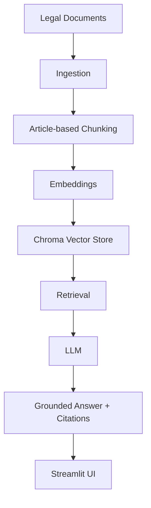
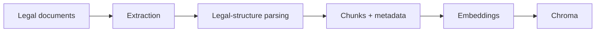
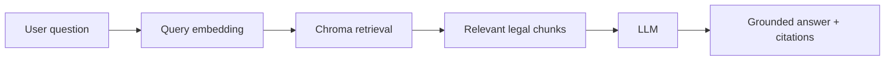

# Mimari

Bu belge, gümrük mevzuatı RAG chatbotunun planlanan mimarisini tanımlar. Henüz uygulanmamış bileşenler de dahil olmak üzere sistemin hedef tasarımını gösterir; ekstra servis veya framework içermez.

## Genel Akış

## Indexing Flow (Offline)

Mevzuat belgelerinin sisteme kazandırıldığı, çevrimdışı çalışan hazırlık akışı.

- **Extraction**: `src/ingest.py` — ham PDF/metin belgelerinden metni çıkarır.
- **Legal-structure parsing**: belge içindeki madde/başlık yapısını tanır (ör. madde no, başlık, sayfa).
- **Chunks + metadata**: `src/chunk.py` — madde bazlı parçalama, her chunk'a kaynak metadata'sı eklenir.
- **Embeddings**: `src/embed.py` — OpenAI embedding modeli (config.EMBEDDING_MODEL) ile vektörleştirme.
- **Chroma**: yerel `PersistentClient` üzerinde koleksiyon olarak saklama (config.COLLECTION_NAME).

## Query Flow (Online)

Kullanıcının soru sorduğu anda çalışan, gerçek zamanlı akış.

- **Query embedding**: kullanıcı sorusu aynı embedding modeliyle vektörleştirilir.
- **Chroma retrieval**: `src/retrieve.py` — en alakalı `config.TOP_K` chunk getirilir.
- **LLM**: `src/generate.py` — OpenAI LLM (config.LLM_MODEL, config.TEMPERATURE) bağlam + soru ile yanıt üretir.
- **Grounded answer + citations**: yanıt, kullanılan chunk'ların kaynak (belge/madde/sayfa) bilgisiyle birlikte döner.
- **Streamlit UI**: `app.py` — soru girişi ve yanıt + kaynak gösterimi.

## Kapsam Dışı

Bu aşamada framework (LangChain, LlamaIndex vb.), ajan mimarisi veya SQL veritabanı planlanmamaktadır. Bkz. `AGENTS.md`.
