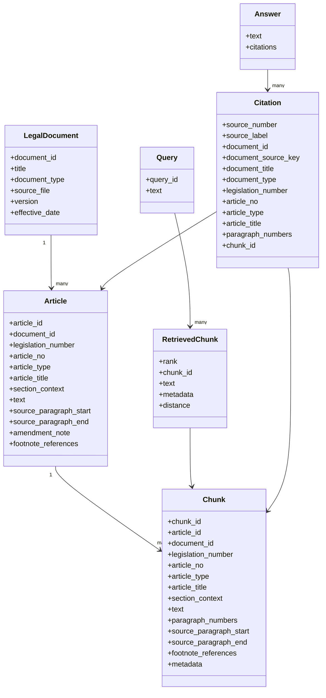

# Veri Modeli

Bu belge, sistemin domain modelini tanımlar. Chroma bir vektör veritabanı olduğu için burada ilişkisel bir SQL şeması değil, kavramsal bir domain modeli tarif edilmektedir.

Bu sürüm, `docs/source-analysis-5326.md` (M1) analizinin önerdiği alanları
modele işler — `src/ingest.py` (M2) zaten `ExtractedParagraph.index` alanı
üzerinden orijinal paragraf konumunu koruyor; `source_paragraph_start`/`_end`
alanları doğrudan bu indekslere karşılık gelecek şekilde tasarlanmıştır.
Parsing/chunking uygulanmıştır. M11 kanonik kaynak kimliği ve güncel provenance
sınırları için bkz. [source-identity-m11.md](source-identity-m11.md).
LegalDocument, Query ve Answer burada kavramsal varlıklardır; aşağıdaki
Article, Chunk, RetrievedChunk ve ValidatedCitation alanları uygulanan tipleri izler.

## Varlıklar (Entities)

### LegalDocument
- `document_id`
- `title`
- `document_type`
- `source_file`
- `version` / `effective_date` (varsa)

### Article
- `article_id`
- `document_id`
- `legislation_number` (opsiyonel açıklayıcı metadata; kanonik kimlik değildir)
- `article_no` (ör. `"2"`, `"42/A"`, `"1"` — Ek/Geçici madde için de kendi sayacındaki numara)
- `article_type` — `normal` | `ek` | `gecici` | `islenemeyen_hukum`. Son
  değer, ana kanuna işlenemeyen hükümler başlığı altındaki article-like
  birimleri ana kanunun aynı numaralı Geçici Maddeleriyle çakıştırmadan
  koruyan nötr yapısal namespace'tir; ayrı bir hukuki nitelendirme değildir.
- `article_title` (madde başlığı paragrafı, ör. `"Sorumluluk"`; bazı Ek/Geçici maddelerde olmayabilir)
- `section_context` (opsiyonel; maddenin içinde bulunduğu Kısım/Bölüm/Ayırım'ın
  **birleşik** bağlamı, ör. `"Birinci Kısım > İkinci Bölüm >
  Üçüncü Ayırım"` — tek bir başlık değil, hiyerarşik yol)
- `text`
- `source_paragraph_start` (bu maddenin başladığı `ExtractedParagraph.index`)
- `source_paragraph_end` (bu maddenin bittiği `ExtractedParagraph.index`)
- `amendment_note` (opsiyonel; madde başlığındaki parantez içi değişiklik notu, ör. `"(Değişik: 6/12/2006-5560/31 md.)"`)
- `footnote_references` (opsiyonel; bu maddeye bağlı dipnot ID'lerinin listesi, `word/footnotes.xml`'den)

### Chunk
- `chunk_id`
- `article_id`
- `document_id`
- `legislation_number` (opsiyonel; ör. `"5326"`)
- `article_no`
- `article_type`
- `article_title`
- `section_context` (opsiyonel; bkz. Article)
- `text`
- `paragraph_numbers` (opsiyonel; chunk içindeki numaralı fıkra kimliklerinin listesi, ör. `["1", "2"]`. Maddenin numaralı fıkrası yoksa boş liste/`null` olabilir)
- `source_paragraph_start`
- `source_paragraph_end`
- `footnote_references` (opsiyonel; kaynak `Article.footnote_references`'tan miras alınan dipnot ID'lerinin listesi. Çok parçalı (multi-chunk) maddelerde bu liste madde-seviyesi provenance'tır; chunk'a özgü tam eşleşme garanti edilmez)
- `metadata` (diğer serbest-form alanlar için; yukarıdaki alanlar zaten en sık kullanılan durumları kapsar)

### Query
- `query_id`
- `text`

### RetrievedChunk
- `rank`
- `chunk_id`
- `text`
- `metadata` (kanonik provenance alanlarını taşır)
- `distance` (ham Chroma mesafesi; similarity skoru değildir)

### Answer
- `text`
- `citations`

### Citation (uygulanan tip: ValidatedCitation)
- `source_number` / `source_label` (yanıt bağlamındaki konum)
- `document_id`
- `document_source_key` (`DocumentSourceKey`)
- `document_title` / `document_type` (SourceRegistry kaydı)
- `legislation_number` (opsiyonel)
- `article_no`
- `article_type` / `article_title`
- `paragraph_numbers` (opsiyonel)
- `chunk_id`

DocumentSourceKey = (document_id, article_type, normalized_article_no).
Üretim atıf oluşturucusu kanonik provenance ister; geçmiş/manual atıf kurucuları
uyumluluk için belge alanlarını None bırakabilir. Article/Chunk belge alanları
alt seviye tiplerde opsiyoneldir; manifest kabulü ve kanonik yardımcılar eksik
kimliği reddeder. SerializedCitation anahtarı kanonik string olarak taşır;
UI belge başlığı ve madde etiketi gösterir. article_id/chunk_id depolama
kimliğidir ve M11'de yeniden adlandırılmamıştır. DOCX sayfa numarası bu
uygulanan Article/ValidatedCitation tiplerinde yer almaz.

## Not: Section ve Paragraph ayrı varlık değildir

**Section** (Kısım/Bölüm/Ayırım) ve **Paragraph** (fıkra), `docs/source-analysis-5326.md`
§11'de belirtildiği gibi, ayrı domain varlıkları değil; parsing/metadata
kavramlarıdır. Section, `Article.section_context` alanına birleşik bir yol
olarak; Paragraph, `Chunk.paragraph_numbers` alanına opsiyonel bir kimlik
listesi olarak yansıtılır. Bu, mimariyi değiştirmez — `LegalDocument →
Article → Chunk` hiyerarşisi aynen korunur.

## İlişkiler

- `LegalDocument` 1 → many `Article`
- `Article` 1 → many `Chunk`
- `Query` → many `RetrievedChunk`
- `Answer` → many `Citation`
- `Citation` → kaynak `Chunk` / `Article`

## Diyagram

## Not

Chroma metadata'sı `document_id`, opsiyonel `legislation_number`, `article_no`,
`article_type`, `article_id` ve mevcut kaynak/section alanlarını taşır.
`chunk_id` ayrı bir metadata alanı olarak kopyalanmaz; Chroma kayıt ID'sidir.
Ayrı bir ilişkisel veritabanı planlanmamaktadır.
