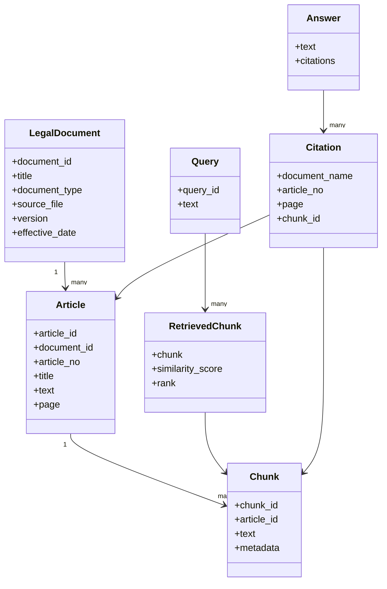

# Veri Modeli

Bu belge, sistemin domain modelini tanımlar. Chroma bir vektör veritabanı olduğu için burada ilişkisel bir SQL şeması değil, kavramsal bir domain modeli tarif edilmektedir.

## Varlıklar (Entities)

### LegalDocument
- `document_id`
- `title`
- `document_type`
- `source_file`
- `version` / `effective_date` (varsa)

### Article
- `article_id`
- `document_id`
- `article_no`
- `title`
- `text`
- `page`

### Chunk
- `chunk_id`
- `article_id`
- `text`
- `metadata`

### Query
- `query_id`
- `text`

### RetrievedChunk
- `chunk`
- `similarity_score`
- `rank`

### Answer
- `text`
- `citations`

### Citation
- `document_name`
- `article_no`
- `page`
- `chunk_id`

## İlişkiler

- `LegalDocument` 1 → many `Article`
- `Article` 1 → many `Chunk`
- `Query` → many `RetrievedChunk`
- `Answer` → many `Citation`
- `Citation` → kaynak `Chunk` / `Article`

## Diyagram

## Not

Bu model Chroma koleksiyonundaki metadata alanlarına (ör. `document_id`, `article_no`, `page`, `chunk_id`) doğrudan karşılık gelecek şekilde tasarlanmıştır; ayrı bir ilişkisel veritabanı planlanmamaktadır.
