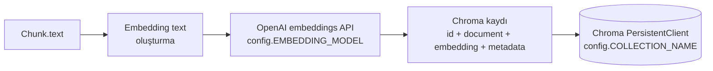

# İndeksleme Sözleşmesi (Chunk → Embedding → Chroma)

Bu belge, M3B'de üretilen doğrulanmış `Chunk` nesnelerinin M4'te nasıl OpenAI
embedding girdilerine ve Chroma kayıtlarına dönüştürüleceğini tanımlar.
Henüz kod yazılmadı — bu, `src/embed.py`/`src/retrieve.py` uygulanırken
hedef alınacak sözleşmedir (bkz. `docs/architecture.md`). Kapsam sınırları
için bkz. §10.



## 1. Embedding sağlayıcısı

- Sağlayıcı: **OpenAI**
- Model: **`text-embedding-3-small`**
- Model, `src/config.py` içindeki `EMBEDDING_MODEL` üzerinden
  konfigüre edilebilir kalır (env: `EMBEDDING_MODEL`) — burada veya
  `src/embed.py` içinde hard-code edilmez.
- API anahtarı (`OPENAI_API_KEY`) yalnızca environment/`.env` üzerinden okunur
  (bkz. `src/config.py`, `AGENTS.md`); hiçbir sağlayıcı kimlik bilgisi kod
  içine gömülmez.

## 2. Embedding metni vs. kaynak metni

`Chunk.text`, değişmez (immutable) hukuki kaynak metnidir ve alıntılama
(citation) ile yanıt temellendirme (answer grounding) için **kanonik metin**
olarak kalır. **`Chunk.text` embedding için yeniden yazılmaz/normalize
edilmez.**

Bunun yerine, yalnızca embedding çağrısına girdi olarak kullanılan, ayrı ve
türetilmiş bir **embedding text** temsili tanımlanır. Bu temsil retrieval
bağlamını (context) zenginleştirmek içindir; **hukuki kaynaktan doğrudan bir
alıntı değildir** ve hiçbir zaman kullanıcıya "kaynak metin" olarak
gösterilmez — gösterilen/alıntılanan her zaman `Chunk.text`'tir.

### Önerilen format

```
{document title}
{article label}
{article title (varsa)}

{original chunk text}
```

- `{document title}`: `Chunk` üzerinde doğrudan bir alan olarak yok — bu
  yalnızca `Chunk.document_id`/`legislation_number` üzerinden
  `data/source_manifest.json`'daki `LegalDocument` girdisine bakılarak elde
  edilir (5326 için: `"{legislation_number} Sayılı {title}"` →
  `"5326 Sayılı Kabahatler Kanunu"`). `src/embed.py`, `src/ingest.py`'nin
  zaten sahip olduğu manifest lookup mantığını (`_load_source_metadata`
  benzeri) yeniden kullanmalı, legal metadata'yı kendi içinde
  hard-code etmemelidir.
- `{article label}`: `article_type`'a duyarlı biçimde türetilir —
  `normal` → `"Madde {article_no}"` (ör. `"Madde 2"`, `"Madde 42/A"`),
  `ek` → `"Ek Madde {article_no}"`, `gecici` → `"Geçici Madde {article_no}"`.
- `{article title (varsa)}`: `Chunk.article_title` doluysa eklenir.
  **`article_title` null ise bu satır tamamen atlanır** — `"None"` yazdırmak
  veya bir başlık uydurmak yasaktır.
- Boş satır + `{original chunk text}`: `Chunk.text`, değiştirilmeden.

### Örnek

```
5326 Sayılı Kabahatler Kanunu
Madde 2
Tanım

Madde 2- (1) Kabahat deyiminden; kanunun, karşılığında idarî yaptırım uygulanmasını öngördüğü haksızlık anlaşılır.
```

`article_title` null olan bir Chunk için (ör. bazı Ek/Geçici maddeler),
üçüncü satır tamamen kaldırılır — sonuç iki başlık satırı, boş satır, sonra
metin olur.

## 3. Chroma stratejisi

Embedding'ler **OpenAI SDK üzerinden `src/embed.py` içinde açıkça**
üretilecektir. **Chroma'nın otomatik embedding function'ına
güvenilmeyecektir** — Chroma'ya önceden hesaplanmış (precomputed)
embedding vektörleri verilir.

Gerekçe:
- embedding sağlayıcısı sınırını (provider boundary) açık ve uygulama
  tarafında tutar,
- model değişikliğini/konfigürasyonunu kolaylaştırır (`EMBEDDING_MODEL`
  tek bir yerden değişir),
- test edilebilirliği artırır (bkz. §9 — OpenAI çağrısı mock'lanabilir,
  Chroma'ya giden embedding sabit/deterministik olur),
- Chroma'ya özgü, gizli bir embedding davranışının pipeline mantığının
  bir parçası hâline gelmesini engeller.

## 4. Chroma kayıt şeması

Her `Chunk` için bir Chroma kaydı:

| Chroma alanı | Kaynak |
|---|---|
| `id` | `Chunk.chunk_id` |
| `document` | `Chunk.text` (değiştirilmeden — kanonik kaynak metin, §2) |
| `embedding` | §2'deki türetilmiş embedding text'i için OpenAI'dan dönen vektör |
| `metadata` | aşağıdaki tablo |

### metadata

| Anahtar | Kaynak | Tip (Chroma'da) |
|---|---|---|
| `document_id` | `Chunk.document_id` | str |
| `legislation_number` | `Chunk.legislation_number` | str |
| `article_no` | `Chunk.article_no` | str |
| `article_type` | `Chunk.article_type` | str |
| `article_title` | `Chunk.article_title` | str (opsiyonel — bkz. aşağı) |
| `section_context` | `Chunk.section_context` | str (opsiyonel) |
| `chunk_id` | `Chunk.chunk_id` | str (id ile aynı değer, filtrelenebilir metadata olarak da tekrarlanır) |
| `source_paragraph_start` | `Chunk.source_paragraph_start` | int |
| `source_paragraph_end` | `Chunk.source_paragraph_end` | int |
| `paragraph_numbers` | `Chunk.paragraph_numbers` | `list[str]` (native string array), opsiyonel — bkz. aşağı |
| `footnote_references` | `Chunk.footnote_references` | `list[int]` (native int array), opsiyonel — bkz. aşağı |

### Opsiyonel değerlerin ele alınışı

Chroma, metadata değeri olarak `str`/`int`/`float`/`bool` skalerlerinin yanı
sıra **homojen (tüm elemanları aynı tipte) array**'leri de destekler
(string array, int array, float array, bool array) — bunlar `$contains` /
`$not_contains` ile filtrelenebilir (bkz. aşağıdaki "Filtreleme notu").
`paragraph_numbers` (`list[str]`) ve `footnote_references` (`list[int]`)
zaten kendi içinde homojen olduğu için bu, native array desteğine doğrudan
uyar. `None` değer ve **boş array** hâlâ desteklenmez.

- **`None` olan alanlar** (`article_title`, `section_context`,
  `paragraph_numbers`, `footnote_references`): metadata dict'ine **hiç
  eklenmez** — anahtar tamamen atlanır. Python `None` değeri asla `"None"`
  literal string'i olarak serialize edilmez, ve hiçbir değer uydurulmaz.
- **Liste değerler, tercih edilen yol** (`paragraph_numbers: list[str] |
  None`, `footnote_references: list[int] | None`): değer **doluysa native
  array olarak** yazılır — `paragraph_numbers=["1", "2"]` → metadata'da
  `["1", "2"]` (string array), `footnote_references=[3, 7]` → metadata'da
  `[3, 7]` (int array). Liste `None` veya **boşsa anahtar tamamen atlanır**
  (Chroma boş array'e izin vermez — `[]` yazılmaz).
- **Sürüm notu:** Array metadata desteği kurulu Chroma sürümüne bağlı
  olabilir. M4, `requirements.txt`'te bu yeteneği destekleyen bir Chroma
  sürümünü **pinlemeli ve doğrulamalıdır** (belirli bir sürüm numarası bu
  belgede verilmez). Pinlenen/kurulu sürüm array metadata'yı
  desteklemiyorsa, `src/embed.py` **sessizce başarısız olmak yerine**
  virgülle ayrılmış string temsiline geri düşmelidir (fallback):
  `paragraph_numbers=["1", "2"]` → `"1,2"`, `footnote_references=[3, 7]` →
  `"3,7"` — bu durumda da boş/`None` liste için anahtar yine tamamen
  atlanır, asla `"None"` veya boş string yazılmaz.
- `document`/`id`/zorunlu sayısal alanlar (`source_paragraph_start/end`)
  Chunk üzerinde zaten zorunlu olduğu için opsiyonellik sorunu taşımaz.

### Filtreleme notu

`paragraph_numbers`/`footnote_references` native array olarak yazıldığında,
bunlar üzerinde bir değerin array içinde geçip geçmediğini sorgulamak için
**`$contains` / `$not_contains`** kullanılır (array membership). **`$in`,
array membership için kullanılmaz** — `$in`, skaler bir metadata alanının
birkaç aday değerden birine eşit olup olmadığını kontrol eder; bu, farklı
bir operasyondur ve burada karıştırılmamalıdır.

## 5. Provenance (izlenebilirlik)

`docs/data-model.md`'de zaten tanımlandığı gibi:

- `Chunk.footnote_references`, çok parçalı (multi-chunk) Article'lar için
  **Article-seviyesi provenance**'tır; her Chunk'a özgü tam eşleşme garanti
  edilmez.
- `Chunk.source_paragraph_start`/`_end` de aynı şekilde, Chunk'a özgü kesin
  bir eşleme mevcut değilse, ebeveyn Article'ın aralığını temsil edebilir.

İndeksleme bu yaklaşımı **olduğu gibi** metadata'ya taşır — M4, daha ince
taneli (fine-grained) bir provenance modeli icat etmeye çalışmaz.

## 6. Koleksiyon (Collection)

Koleksiyon adı `src/config.py`'deki `COLLECTION_NAME` üzerinden gelir
(env: `COLLECTION_NAME`, mevcut varsayılan: **`gumruk_mevzuati`**).

Mevzuat başına ayrı bir Chroma koleksiyonu **oluşturulmaz**. Birden fazla
mevzuat belgesi zamanla **aynı koleksiyonda bir arada** bulunmalı ve
`document_id`/`legislation_number` gibi metadata alanları üzerinden
ayrıştırılabilir/filtrelenebilir olmalıdır (bkz. §4 metadata şeması —
zaten bu ayrımı destekleyecek alanları içeriyor).

## 7. Kalıcılık (Persistence)

Planlanan yerel geliştirme deposu **Chroma `PersistentClient`**'tır.

Konfigüre edilebilir bir yerel kalıcılık yolu tanımlanır:

```
CHROMA_PATH=chroma
```

(env değişkeni, `src/config.py`'ye M4'te eklenecek; **bu belge kapsamında
henüz uygulanmıyor**.)

Bu dizin yerel/üretilmiş (generated) bir durumdur ve `.gitignore`'da
kalmalıdır — `.gitignore` içinde zaten `chroma/` ve `chroma_db/` girdileri
mevcut, `CHROMA_PATH` varsayılanı (`chroma`) bunlarla tutarlıdır.

## 8. Idempotency (yeniden çalıştırılabilirlik)

Aynı deterministik `chunk_id`'lerle indeksleme işlemi tekrar çalıştırıldığında
**yinelenen (duplicate) kayıt oluşturulmamalıdır**.

M4 uygulaması, ID'leri körü körüne `add` ile eklemek yerine **açık bir
idempotent strateji** (ör. Chroma'nın `upsert` API'si — `chunk_id`'yi
Chroma `id` olarak kullanarak) benimsemelidir. `Chunk.chunk_id`'nin zaten
deterministik ve source-order'a duyarlı olması (bkz. `docs/data-model.md`,
`src/chunk.py`) bu stratejiyi doğrudan mümkün kılar.

## 9. M4 için test stratejisi

- Normal (unit) test paketi **gerçek OpenAI API'sini asla çağırmaz** ve
  bunun için bir `OPENAI_API_KEY` gerektirmez.
- OpenAI embedding çağrıları ve (gerekirse) Chroma etkileşimleri **mock/fake**
  edilir — ör. sabit/deterministik bir sahte vektör döndüren bir fake
  embedding fonksiyonu, `src/ingest.py`/`src/chunk.py` testlerindeki
  "self-contained fixture" yaklaşımıyla tutarlı biçimde.
- Gerçek `OPENAI_API_KEY` gerektiren, gerçek API'ye karşı çalışan **ayrı,
  opsiyonel bir integration test** eklenebilir — `tests/test_ingest.py` ve
  `tests/test_chunk.py`'deki `data/raw/` kaynağına bağlı, anahtar/kaynak
  yoksa SKIP eden entegrasyon testleriyle aynı desen (bkz. o dosyalardaki
  `@pytest.mark.skipif`).

## 10. Kapsam sınırı

**M4 kapsar:**

```
Chunk → embedding representation → OpenAI embedding → Chroma indexing
```

**M4 kapsamaz** (sonraki milestone'lar):

- semantic query retrieval (`src/retrieve.py`)
- LLM generation (`src/generate.py`)
- Streamlit arayüzü (`app.py`)

Bu belge kapsamında hiçbir domain-model (`docs/data-model.md`) değişikliği
yapılmamıştır.

## 11. Maliyet notu

`text-embedding-3-small` ile 53 chunk'ın embedding'ini oluşturmak
**ihmal edilebilir düzeyde** bir maliyettir (bir centin çok altında).
Ancak M4 uygulaması, gerçek maliyetin tahmine değil **gerçek kullanıma**
dayanarak ölçülebilir olması için embedding çağrısında **token kullanımını
loglamalıdır** — bu, `docs/evaluation.md`'deki "Token usage" / "Estimated
API cost" metrik planıyla (şu an TBD) tutarlıdır; M4, o placeholder'ları
gerçek sayılarla doldurmak için gereken veriyi üretmelidir.

Ayrıca, OpenAI SDK'nın desteklediği yerlerde embedding istekleri
**batch (toplu) olarak** gönderilmelidir (tek bir `embeddings.create`
çağrısına birden fazla input string vererek) — çağrı başına network/istek
overhead'ini azaltmak için, chunk başına ayrı bir API çağrısı yapmak yerine.
